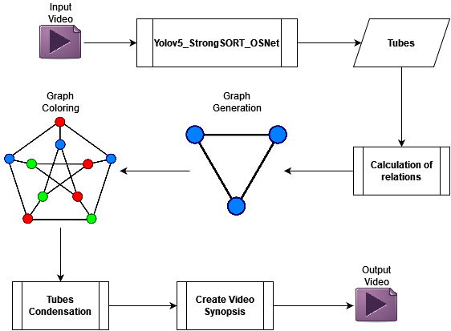

<h1 align="center">pcgvs (Potential Collision Graph Video Synopsis)</h1>


<p align="center"></p>


------

- **[Quickstart](#-quickstart)**
- **[Data Flow](#-data-flow)**
- **[Bibliography](#-bibliography)**
- **[Authors](#-authors)**

------


## ⚡ Quickstart

Create another conda environment: 

```bash
conda create --name pcgvs python=3.9
```

Install the package locally:

```bash
pip install -e .
```

Now you can use the package in your scripts! For example:

```python
from pcgvs.extraction import TubeExtraction

...
```


## 📊 Data flow 

<p align="center">
  
</p>


## 📚 Bibliography

```
@software{glenn_jocher_2021_5563715,
  author       = {Glenn Jocher et. al.},
  title        = {{ultralytics/yolov5: v6.0 - YOLOv5n 'Nano' models, 
                   Roboflow integration, TensorFlow export, OpenCV
                   DNN support}},
  month        = oct,
  year         = 2021,
  publisher    = {Zenodo},
  version      = {v6.0},
  doi          = {10.5281/zenodo.5563715},
  url          = {https://doi.org/10.5281/zenodo.5563715}
}
```

```
@misc{yolov5-strongsort-osnet-2022,
  title			= {Real-time multi-camera multi-object tracker using YOLOv5 and StrongSORT with OSNet},
  author		= {Mikel Broström},
  howpublished  	= {\url{https://github.com/mikel-brostrom/Yolov5_StrongSORT_OSNet}},
  year			= {2022}
}
```

```
@article{HeGSQH17,  
  title 	= {Graph coloring based surveillance video synopsis},  
  author 	= {Yi He and Changxin Gao and Nong Sang and Zhiguo Qu and Jun Han},  
  year 		= {2017},  
  doi 		= {10.1016/j.neucom.2016.11.011},  
  url 		= {http://dx.doi.org/10.1016/j.neucom.2016.11.011},  
  researchr 	= {https://researchr.org/publication/HeGSQH17},  
  cites 	= {0},  
  citedby 	= {0},  
  journal 	= {Neurocomputing},  
  volume 	= {225},  
  pages 	= {64-79}, 
}
```

```
@INPROCEEDINGS{8803795,  
  author	= {Pappalardo, Giovanna and Allegra, Dario and Stanco, Filippo and Battiato, Sebastiano},  
  booktitle	= {2019 IEEE International Conference on Image Processing (ICIP)},  
  title		= {A New Framework for Studying Tubes Rearrangement Strategies in Surveillance Video Synopsis},   
  year		= {2019},  
  volume	= {},  
  number	= {},  
  pages		= {664-668},  
  doi		= {10.1109/ICIP.2019.8803795}
}
```


## 🖊️ Authors 

* [Luigi Seminara](https://github.com/Gigi-G)
* [Lemuel Puglisi](https://github.com/LemuelPuglisi) 
